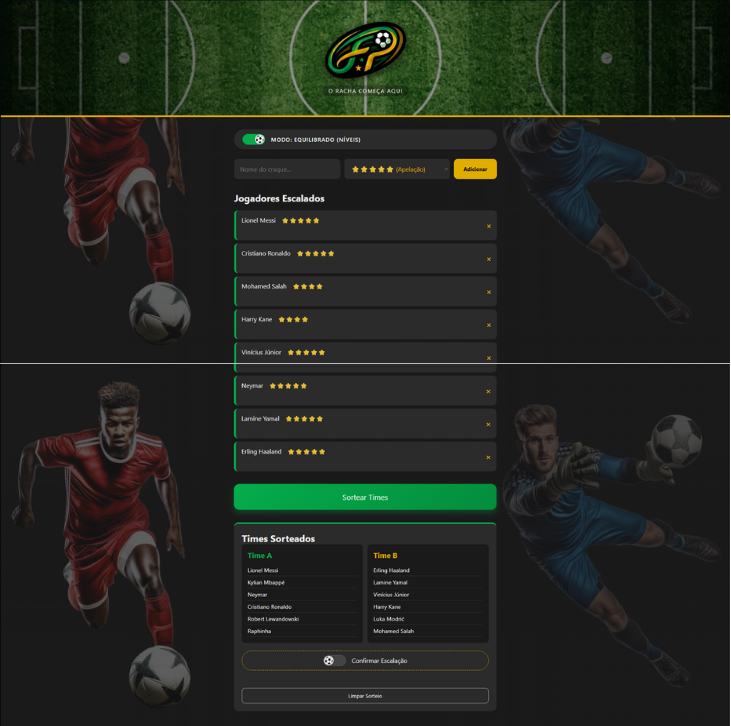

# ⚽ Fair Play App

  

---

O **Fair Play App** é uma aplicação web desenvolvida para gerenciar e organizar partidas de forma justa e equilibrada. A ferramenta foi criada para solucionar o problema comum de divisão de times, permitindo cadastrar jogadores, gerenciar listas e realizar sorteios de maneira automatizada, garantindo que o jogo seja divertido e imparcial para todos.

Ideal para a organização de rachas, torneios amistosos e encontros esportivos.

---

## 🚀 Funcionalidades

* **Gerenciamento de Jogadores:** Permite adicionar participantes à lista de presença de forma rápida e intuitiva.
* **Sorteio Inteligente:** Divisão automatizada dos jogadores em equipes equilibradas com apenas um clique.
* **Interface Dinâmica:** Atualização do status dos times em tempo real conforme as entradas são validadas.
* **Design Responsivo:** Totalmente otimizado para uso em smartphones e computadores, ideal para ser usado direto na beira do campo ou da quadra.

---

## 🛠️ Tecnologias Utilizadas

* **HTML5:** Estrutura semântica para os formulários de cadastro e exibição dos times.
* **CSS3:** Estilização moderna, focada na usabilidade, clareza visual e adaptabilidade para telas mobile.
* **JavaScript (ES6+):** Lógica para manipulação de arrays (armazenamento e embaralhamento), validação de dados e renderização dinâmica dos componentes na tela.

---

## 🧠 Aprendizados e Desafios

O desenvolvimento do Fair Play App permitiu consolidar conceitos avançados de lógica e controle de estados no front-end:

1. **Manipulação de Arrays:** Uso de métodos JavaScript para armazenar, embaralhar (algoritmos de randomização) e dividir listas de elementos em subgrupos (times).
2. **Validação e Fluxo:** Implementação de travas de segurança para evitar jogadores duplicados ou sorteios com número insuficiente de participantes.
3. **Persistência e Interface:** Sincronização entre as ações do usuário (cliques e digitação) e o que é exibido visualmente no DOM, mantendo a interface limpa e reativa.

(Criado por Rodrigo Jatobá)

---

## 🌐 Acesse o projeto
**🔗 Deploy (GitHub Pages):**
* [https://rodrigojatoba.github.io/Fair-Play-App/]

---

## 🤝 Contato

**Rodrigo Jatobá** 

